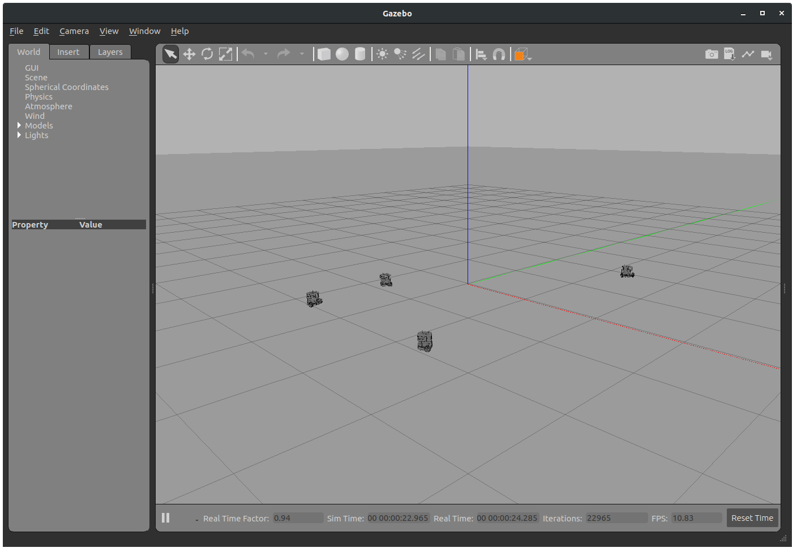
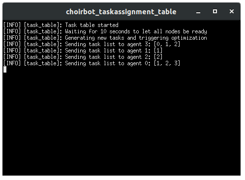

========================================================
Distributed dynamic task assignment with ground robots
========================================================

In this page we show how to implement a distributed dynamic task assignment
scenario. We consider the task assignment problem formulation and the distributed
simplex algorithm proposed in :cite:`ta-burger2012distributed`.
Each robot cooperates to compute a problem solution and executes the
self-assigned tasks. We consider an additional cloud node that generates task
requests and sends them to the robots dynamically. The scenario is simulated
on Gazebo with Turtlebot3 ground robots.

Prerequisites
----------------------------
We assume a working installation of **ChoiRbot** and Gazebo is
available (see the :ref:`installation page <installation>`),
and also that the Turtlebot3 ROS 2 files are installed.
This example requires the `DISROPT <https://github.com/OPT4SMART/disropt>`_
package to be installed.

The reader is assumed to be familiar with the basic concepts
of ROS 2, Python and **ChoiRbot**
(see the :ref:`quick start page <quickstart>`).

Description of the problem
----------------------------
We consider a team of robots that must self-assign a set of tasks while minimizing the total robot path length.
Assume there are :math:`N` robots (indexed by :math:`i`) and :math:`N` tasks (indexed by :math:`k`).
A scalar :math:`c_{ik}` represents the cost incurred by robot :math:`i` when servicing task :math:`k`.
The goal is to find the optimal assignment, i.e. to assign each robot :math:`i` to exactly one task
:math:`j` such that the total incurred cost is minimized. To compute the optimal assignment, robots
must solve the following linear program

.. math::

    \begin{aligned}
        \min_{x} \:
        & \: \sum_{i, k} c_{ik} x_{ik}
        \\
        \text{subj. to} \:
        & \: 0 \leq x_{ij} \leq 1, \hspace{0.5cm} \forall \: i, k
        \\
        & \: \sum_{k} x_{ik} = 1 \hspace{0.5cm} \forall \: i,
        \\
        & \: \sum_{i} x_{ik} = 1 \hspace{0.5cm} \forall \: k.
    \end{aligned}

Once an optimal solution of the previous problem is found, the binary variable
:math:`x_{ik}` is :math:`1` if task :math:`k` is assigned to robot :math:`i` and :math:`0`
otherwise. The constraints in the optimization problem ensure a one-to-one assignment.
Note that in the optimization problem it is assumed that the number of tasks and the number
of robots is the same (:math:`N`).

The optimization problem is solved using the Distributed Simplex algorithm in :cite:`ta-burger2012distributed`.
After the solution of the problem, each robot :math:`i` examines the variables :math:`x_{ik}`
for all :math:`k`. Only one of them will be equal to one, corresponding to the index :math:`k`
of the assigned task. The robot immediately start execution of the task by moving itself
toward the goal position. In this example, a tasks is considered executed once the robot
arrives at its position.

Dynamic scenario
~~~~~~~~~~~~~~~~~~~~~~~
In the considered example, task requests are assumed to arrive dynamically over time.
That is, initially there are :math:`N` tasks that must be executed by the robots.
As soon as one of the tasks has been executed, another task request arrives and the
robots re-run the optimization algorithm to compute a new assignment.

Implementation in ChoiRbot
--------------------------------
In order to implement the dynamic task assignment example in **ChoiRbot**,
we consider the following nodes for each robot:

* a Team Guidance node that receives task requests, runs the distributed optimization
  algorithm (which requires communication with the neighbors) to determine the task
  assigned to the robot and triggers execution of the task to the planning node
* a Planning node that receives the target positions and interfaces with the
  Control node to reach those positions
* a Control node implementing a closed-loop unicycle controller to reach the
  designated positions

For this simulation we also consider an additional "Task table" node that
generates the tasks requests and sends them to the robots.

To run the simulation, we will also need to interface **ChoiRbot** with
Turtlebot3 robots in Gazebo. Finally, we will also need a launch file
and the executable scripts (as required by the **ChoiRbot** paradigm).

We analyze each of these components separately in the following subsections.

Task table
~~~~~~~~~~~~~~~~~~~~~~~~~~~
The task table is implemented in the class :class:`~choirbot.guidance.task.PositionTaskTable` and is
responsible for maintaining the list of task requests. The flow of the class is as follows

1. initially, the class generates :math:`N` task requests;
2. the class sends a trigger signal to the robots to inform that the task list has changed;
3. each robot can retrieve the updated task list from the table by using a ROS service;
4. robots run the optimization algorithm to compute the assignment and execute the tasks
   (the class does nothing);
5. as soon as a task :math:`j` has been completed by a robot :math:`i`, robot :math:`i`
   informs the class that task :math:`j` has been executed by using a ROS service;
6. the class generates a new task and repeats step 2.

Moreover

* each task is characterized by a sequence number (``seq_num``) and an ID (``id``).
  The ``seq_num`` is unique and is different for each task generated by the class throughout
  its execution, while IDs always belong to the range :math:`\{0, \ldots, N-1\}` such that
  each task processed within the same optimization problem have different IDs, thus they are
  re-used throughout the execution of the class (recall that in each optimization problem
  solved by the robots there are always exactly :math:`N` tasks);
* the list received by each robot :math:`i` contains only the tasks that can be potentially
  performed by robot :math:`i`. Other tasks are disallowed and can only be performed by other
  robots.

The :class:`~choirbot.guidance.task.PositionTaskTable` class is a specialization of the
:class:`~choirbot.guidance.task.TaskTable` abstract class. The base abstract class
may be extended to consider more complex scenarios where tasks do not merely consist
in reaching target positions.

Team guidance
~~~~~~~~~~~~~~~~~~~~~~~~~~~
The team guidance layer of each robot is implemented in the class
:class:`~choirbot.guidance.task.TaskGuidance` and is responsible for the execution of
tasks (by interacting with the local planning layer), the execution of the distributed
optimization algorithm and for interfacing with the task table.
The flow of the class is as follows

1. when the class receives the trigger signal from the task table, it asks for the updated
   task list and waits for it on the separate optimization thread implemented with the
   class :class:`~choirbot.guidance.task.task.TaskOptimizationThread`;
2. upon receiving the new task list, the optimization thread starts the distributed
   optimization algorithm, which will require communication with neighbors;
3. when the optimization is completed, the main thread saves the queue of tasks to be
   executed by the robot (in this example each robot is assigned exactly one task so
   the queue contains only one task). If a task is currently being executed by the class,
   it is canceled;
4. the class executes the enqueued tasks in order until the queue is empty;
5. if a new trigger signal is received from the task table, the task queue is emptied and
   the class keeps on executing the task that is currently in progress.
   Meanwhile, step 1 is repeated.

Just as in the MPC example, solving the optimization problem requires an Optimizer class
interacting with :class:`~choirbot.guidance.task.task.TaskOptimizationThread`.
In this example, this is implemented with the :class:`~choirbot.guidance.optimizer.TaskOptimizer`,
which formulates the task assignment problem and executes the Distributed Simplex algorithm
(:cite:`ta-burger2012distributed`) implemented in DISROPT.

Execution of enqueued tasks is delegated to the
:class:`~choirbot.guidance.task.task.PositionTaskExecutor` class. This class uses the
ROS action of the planning layer to move the robot to the target positions.
The :class:`~choirbot.guidance.task.TaskGuidance` class is notified by this class
when a task has been completed in order to continue its flow.

The :class:`~choirbot.guidance.task.task.PositionTaskExecutor` class is a specialization
of the :class:`~choirbot.guidance.task.task.TaskExecutor` abstract class. The base abstract
class may be extended to consider more complex scenarios where tasks do not merely consist
in reaching target positions.

Planning and control
~~~~~~~~~~~~~~~~~~~~~~~~~~~
The planning node is implemented in the :class:`~choirbot.planner.TwoDimPointToPointPlanner`.
It simply consists of a ROS action that receives target positions from the Team guidance layer
and forwards them to the control node on a ROS topic. Tasks currently in execution are aborted
if the Team guidance layer sends a new action request prematurely.

The control node is implemented in the class TODO REF.
It consists of the feedback control law for unicycles presented in :cite:`ta-park2011smooth`.

Interfacing with Gazebo
~~~~~~~~~~~~~~~~~~~~~~~~~~~
See :ref:`the corresponding section <interfacing_with_gazebo>` in the formation control example

Launch file and executables
~~~~~~~~~~~~~~~~~~~~~~~~~~~
See :ref:`the corresponding section <launch_file>` in the formation control example.

Running the simulation
-----------------------------
To run the simulation, we simply need to execute the launch file.
First we source the workspace:

.. code-block:: bash

    source install/setup.bash

Now we are ready to run the example:

.. code-block:: bash

    ros2 launch choirbot_examples taskassignment.launch.py

A Gazebo window will open. After a few seconds, the task table generates tasks and
robots start to move to their target positions:

.. rubric:: References

.. bibliography:: ../biblio.bib
    :labelprefix: TA
    :keyprefix: ta-