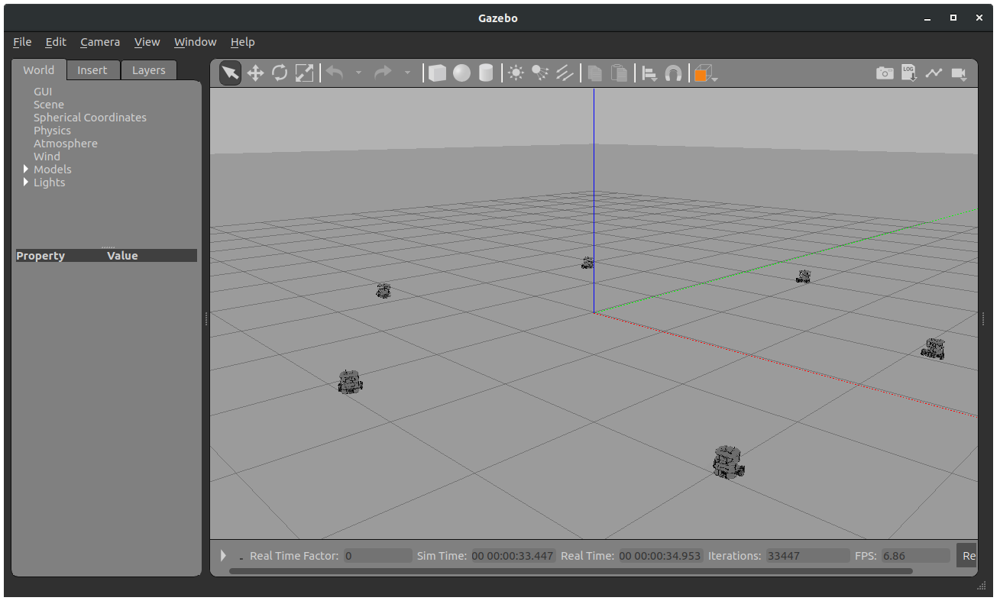

.. _examples_formationcontrol:

====================================================
Distributed formation control for unicycle vehicles
====================================================

In this page we show how to implement a distributed formation control algorithm
for a team of unicycle vehicles. The resulting algorithm is simulated with
Gazebo by using Turtlebot3 ground robots.
A reference for this example can be found in :cite:`fc-mesbahi2010graph`.

Prerequisites
----------------------------
We assume a working installation of **ChoiRbot** and Gazebo is available
(see the :ref:`installation page <installation>`),
and also that the Turtlebot3 ROS 2 files are installed.
Moreover, we assume the reader to be familiar with the basic concepts
of ROS 2, Python and **ChoiRbot**
(see the :ref:`quick start page <quickstart>`).

Maths of the problem
----------------------------
We consider driving a team of :math:`N` robots to a translationally
independent formation in the :math:`(x,y)` plane that satisfies a given
set of constraints.

System dynamics and communication graph
~~~~~~~~~~~~~~~~~~~~~~~~~~~~~~~~~~~~~~~~
The considered algorithm models each robot as having single-integrator dynamics

.. math::

    \dot{x}_i = u_i,

where for all :math:`i \in \{1, \ldots, N\}`, :math:`x_i \in \mathbb{R}^2` is the
:math:`i`-th system state (i.e., position) and :math:`u_i \in \mathbb{R}^2`
is the :math:`i`-th system input (i.e., velocity).

We assume the robots communicate according to a given
undirected graph :math:`\mathcal{G} = (\mathcal{V}, \mathcal{E})`, where
:math:`\mathcal{V} = \{1, \ldots, N\}` is the set of robots and
:math:`\mathcal{E} \subset \mathcal{V} \times \mathcal{V}` is the set of
edges. If :math:`(i,j) \in \mathcal{E}`, then also :math:`(j,i) \in \mathcal{E}`
and robots :math:`i` and :math:`j` can send information to each other.
The set of neighbors of each agent :math:`i` is denoted by
:math:`\mathcal{N}_i = \{j \in \mathcal{V} \mid (i,j) \in \mathcal{E}\}`.

Formation specification and distributed control law
~~~~~~~~~~~~~~~~~~~~~~~~~~~~~~~~~~~~~~~~~~~~~~~~~~~~
The desired formation is assumed to be rigid (see also :cite:`fc-mesbahi2010graph`) and is
specified by a set of desired distances :math:`\{d_{ij}\}_{(i,j) \in \mathcal{E}}`
between any two communicating robots :math:`i` and :math:`j`.

The distributed control law applied by each robot :math:`i` is

.. math::
    u_i(t) = \sum_{j \in \mathcal{N}_i} (\|x_i(t) - x_j(t)\|^2 - d_{ij}^2) (x_j(t) - x_i(t)).

In the example considered here, there are :math:`N = 6` ground robots that must
form an hexagon with side :math:`L`. Adjacent robots can communicate and also opposite
robots, therefore the adjacency matrix of the communication graph is

.. math::

    \text{Adj} =
    \begin{bmatrix}
        0 & 1 & 0 & 1 & 0 & 1\\
        1 & 0 & 1 & 0 & 1 & 0\\
        0 & 1 & 0 & 1 & 0 & 1\\
        1 & 0 & 1 & 0 & 1 & 0\\
        0 & 1 & 0 & 1 & 0 & 1\\
        1 & 0 & 1 & 0 & 1 & 0\\
    \end{bmatrix}

Adjacent robots must have distance :math:`L`, while opposite robots must have
distance :math:`2L`, therefore the matrix of desired inter-robot distances is

.. math::

    D =
    \begin{bmatrix}
        0  & L  & 0  & 2L & 0  & L \\
        L  & 0  & L  & 0  & 2L & 0 \\
        0  & L  & 0  & L  & 0  & 2L\\
        2L & 0  & L  & 0  & L  & 0 \\
        0  & 2L & 0  & L  & 0  & L \\
        L  & 0  & 2L & 0  & L  & 0 \\
    \end{bmatrix}

Implementation in ChoiRbot
--------------------------------
In order to implement the formation control example in **ChoiRbot**,
we consider the following nodes for each robot:

* a Team Guidance node that exchanges the current position with the neighbors
  and computes the input :math:`u_i(t)` with a certain frequency
* a Control node that converts the single-integrator input (vector velocity)
  into the corresponding suitable unicycle input (angular and linear velocity)

To run the simulation, we will also need to interface **ChoiRbot** with
Turtlebot3 robots in Gazebo. Finally, we will also need a launch file
and the executable scripts (as required by the **ChoiRbot** paradigm).

We analyze each of these components separately in the following subsections.

Team Guidance
~~~~~~~~~~~~~~~~~~~~~~~~~~~
The Team Guidance layer is responsible for the actual implementation of the
distributed control law outlined above. It is based on the abstract class
:class:`~choirbot.guidance.distributed_control.DistributedControlGuidance`,
which extends the basic :class:`~choirbot.guidance.Guidance` class as follows:

.. code-block:: python

    from geometry_msgs.msg import Vector3
    from choirbot.guidance import Guidance

    class DistributedControlGuidance(Guidance):

        def __init__(self, update_frequency: float, pos_handler: str=None, pos_topic: str=None):
            super().__init__(pos_handler, pos_topic)
            self.publisher_ = self.create_publisher(Vector3, 'velocity', 1)
            self.update_frequency = update_frequency
            self.timer = self.create_timer(1.0/update_frequency, self.control)

When the class is instantiated, the ``__init__`` method creates a publisher
for the velocity inputs and creates a timer that executes the method ``control``
with a user-defined frequency. Note that, since this class extends
:class:`~choirbot.guidance.Guidance`, it inherits several useful attributes:

* ``current_pose``, which always contains the most up-to-date robot pose and is
  periodically updated by the parent class;
* ``communicator``, which is an instance of the class
  :class:`~choirbot.communicator.Communicator` and provides methods
  for graph-based communication;
* ``in_neighbors`` and ``out_neighbors``, which are the lists of the
  robot's in- and out- neighbors (in this example the graph is undirected
  so the two lists are identical and are equal to :math:`\mathcal{N}_i`).

The main body of the class that is repeatedly executed is contained in the
``control`` method. The code is as follows:

.. code-block:: python

    def control(self):
        # exchange current position with neighbors
        data = self.communicator.neighbors_exchange(self.current_pose.position, self.in_neighbors, self.out_neighbors, False)

        # compute input
        u = self.evaluate_velocity(data)

        # send input to planner/controller
        self.send_input(u)

When the method is run, it first exchanges the current position with the neighbors
by calling :func:`~choirbot.communicator.Communicator.neighbors_exchange`,
which returns a dictionary with the positions received from the neighbors.
Then, it calls the method ``evaluate_velocity``, which computes the actual
value of :math:`u_i(t)`, and finally calls the method ``send_input``,
which sends the input to the controller node. The method ``evaluate_velocity``
is left unimplemented in order to allow for arbitrary control laws,
while the body of ``send_input`` is very simple and only publishes the
computed input on the ``velocity`` topic:

.. code-block:: python

    def send_input(self, u):
        msg = Vector3()

        msg.x = u[0]
        msg.y = u[1]
        msg.z = u[2]

        self.publisher_.publish(msg)

In order to implement the formation control law, the class
:class:`~choirbot.guidance.distributed_control.DistributedControlGuidance`
must be extended to override the ``evaluate_velocity`` method.
The child class :class:`~choirbot.guidance.distributed_control.FormationControlGuidance`
is as follows:

.. code-block:: python

    import numpy as np
    from numpy.linalg import norm

    class FormationControlGuidance(DistributedControlGuidance):

        def __init__(self, update_frequency: float, gain: float=0.1, pos_handler: str=None, pos_topic: str=None):
            super().__init__(update_frequency, pos_handler, pos_topic)
            self.formation_control_gain = gain
            self.weights = self.get_parameter('weights').value

        def evaluate_velocity(self, neigh_data):
            u = np.zeros(3)
            for ii, pos_ii in neigh_data.items():
                error = pos_ii - self.current_pose.position
                u += self.formation_control_gain*(norm(error)**2- self.weights[ii]**2) * error
            return u

As it can be seen from the ``__init__`` method, this class requires that
the ROS parameter ``weights`` is set. This parameter represents the desired
inter-robot distances :math:`\{d_{ij}\}_{(i,j) \in \mathcal{E}}` and must be
passed to each robot :math:`i` as a dictionary with each element having key
:math:`j` and value :math:`d_{ij}`.
The ``evaluate_velocity`` method is simply the implementation of
the distributed formation control law and returns :math:`u_i(t)`.

Unicycle control
~~~~~~~~~~~~~~~~~~~~~~~~~~~
The goal of the control node is to translate the vector velocity input
:math:`u_i(t)` into the corresponding unicycle inputs :math:`v_i(t)`
(linear velocity) and :math:`\omega_i(t)` (angular velocity).
This translation is performed according to the approach described in
:cite:`fc-wilson2020robotarium` within the class :class:`~choirbot.controller.UnicycleVelocityController`.
The initialization block of the class is as follows:

.. code-block:: python

    from choirbot.controller import Controller
    from geometry_msgs.msg import Vector3, Twist
    import numpy as np

    class UnicycleVelocityController(Controller):

        def __init__(self, pos_handler: str=None, pos_topic: str=None):
            super().__init__(pos_handler, pos_topic)
            self.subscription = self.create_subscription(Vector3, 'velocity', self.control_callback, 1)
            self.publisher_ = self.create_publisher(Twist, 'cmd_vel', 1)
            self.yaw = 0.0
            self.yaw_old = 0.0
            self.yaw_old_old = 0.0

Since the main job of this class is to translate the vector velocity input
into a unicycle input, in the ``__init__`` method we simply create a publisher
and a subscription for the relative topics and we initialize the quantities
for the control translation scheme. The main job is performed by the subscription
callback method ``control_callback``, which implements the law described in
:cite:`fc-wilson2020robotarium` and publishes the translated input in the ``cmd_vel`` topic.

.. _interfacing_with_gazebo:

Interfacing with Gazebo
~~~~~~~~~~~~~~~~~~~~~~~~~~~
In order to run the algorithm within the Gazebo simulation environment,
we first need to create the robots. To this end, we use the
``SpawnEntity`` service provided by the Gazebo ros factory plugin, as suggested by
`this thread <https://discourse.ros.org/t/spawning-a-robot-entity-using-a-node-with-gazebo-and-ros-2/9985>`_
of the ROS community.
This service requires the Gazebo process to be executed with the following
command, which will be embedded later directly in the launch file:

.. code-block:: bash

    gazebo -s libgazebo_ros_factory.so

To create the robots, we use a dedicated node interfacing with the ``SpawnEntity``
service. It is implemented in the file ``turtlebot_spawner.py`` in the
``choirbot_examples`` package. The node requires the following ROS parameters

* ``position``: coordinates where the robot will be spawned
* ``namespace``: ROS namespace for the robot nodes and topics

In the launch file, we will use differentiated namespaces for each robot
and we also set the initial position for the formation control algorithm.

After each robot is created (suppose with the namespace ``ns``), Gazebo will publish
its updated pose in the ``/ns/odom`` topic, which is retrieved by the Team guidance
class to compute the control input. Robots receive commands in the ``/ns/cmd_vel``
topic as published by the unicycle control.

.. _launch_file:

Launch file and executables
~~~~~~~~~~~~~~~~~~~~~~~~~~~
To launch the simulation, we first create the executable files in which all the relevant
classes are instantiated. The following block shows the guidance executable:

.. code-block:: python

    import rclpy
    from choirbot.guidance.distributed_control import FormationControlGuidance
    import time

    def main():
        rclpy.init()

        frequency = 100
        gain = 0.1

        guidance = FormationControlGuidance(frequency, gain, 'pubsub', 'odom')

        rclpy.spin(guidance)
        rclpy.shutdown()

The body of the ``main`` function simply initializes the ROS python client (``rclpy``),
creates the team guidance class
:class:`~choirbot.guidance.distributed_control.FormationControlGuidance`
and ``spin`` 's over it. The code for the control layer is similar.
We need to add the two executables as entry points in the ``setup.py`` file of the package,
together with the turtlebot spawner:

.. code-block:: python

    entry_points={
        'console_scripts': [
            'choirbot_formationcontrol_guidance = choirbot_examples.formationcontrol.guidance:main',
            'choirbot_formationcontrol_control = choirbot_examples.formationcontrol.control:main',
            'choirbot_turtlebot_spawner = choirbot_examples.turtlebot_spawner:main'
        ],
    }

Finally, we can write the launch file, which will do the following tasks:

* open an instance of Gazebo
* spawn the Turtlebot robots with differentiated namespaces
* execute the Team guidance layer and the control layer of each robot

First, we prepare a few needed variables as follows

.. code-block:: python

    import numpy as np

    def generate_launch_description():

        # reset seed of random number generator
        np.random.seed(1)

        L = 3.0 # length of hexagon sides

        # generate communication matrix
        Adj = np.array([ # alternated zeros and ones
            [0, 1, 0, 1, 0, 1],
            [1, 0, 1, 0, 1, 0],
            [0, 1, 0, 1, 0, 1],
            [1, 0, 1, 0, 1, 0],
            [0, 1, 0, 1, 0, 1],
            [1, 0, 1, 0, 1, 0]
        ])

        # generate matrix of desired inter-robot distances
        # adjacent robots have distance L
        # opposite robots have distance 2L
        W = np.array([
            [0,   L,   0,   2*L, 0,   L],
            [L,   0,   L,   0,   2*L, 0],
            [0,   L,   0,   L,   0,   2*L],
            [2*L, 0,   L,   0,   L,   0],
            [0,   2*L, 0,   L,   0,   L],
            [L,   0,   2*L, 0,   L,   0]
        ])

        # generate coordinates of an hexagon with center in the origin
        a = L/2
        b = np.sqrt(3)*a

        P = np.array([
            [-b, a , 0],
            [0, 2.0*a, 0],      
            [b, a, 0],
            [b, -a, 0],
            [0, -2.0*a, 0],
            [-b, -a, 0]
        ])

        # initial positions have a perturbation of at most L/3
        P += np.random.uniform(-L/3, L/3, (6,3))

Now we create a launch description with the robot executables:

.. code-block:: python

    from launch_ros.actions import Node
    from launch.actions import TimerAction
    from launch import LaunchDescription

    def generate_launch_description():

        # ... previous code

        robot_launch = []

        # add executables for each robot
        for i in range(6):

            in_neighbors  = np.nonzero(Adj[:, i])[0].tolist()
            out_neighbors = np.nonzero(Adj[i, :])[0].tolist()
            weights = W[i,:].tolist()

            # guidance
            robot_launch.append(Node(
                package='choirbot_examples', node_executable='choirbot_formationcontrol_guidance', output='screen',
                node_namespace='agent_{}'.format(i),
                parameters=[{'agent_id': i, 'N': N, 'in_neigh': in_neighbors, 'out_neigh': out_neighbors, 'weights': weights}]))
            
            # controller
            robot_launch.append(Node(
                package='choirbot_examples', node_executable='choirbot_formationcontrol_controller', output='screen',
                node_namespace='agent_{}'.format(i),
                parameters=[{'agent_id': i}]))
        
        # the previous executables will be started with a 10-second delay to let Gazebo open
        timer_action = TimerAction(period=10.0, actions=[LaunchDescription(robot_launch)])

Note that in the previous code we passed the relevant ROS parameters for the
Team guidance and Control classes. For each robot, we must also run a robot spanwer node:

.. code-block:: python

    def generate_launch_description():

        # ... previous code

        launch_description = []

        for i in range(6):

            position = P[i, :].tolist()

            # turtlebot spawner
            launch_description.append(Node(
                package='choirbot_examples', node_executable='choirbot_turtlebot_spawner', output='screen',
                parameters=[{'namespace': 'agent_{}'.format(i), 'position': position}]))

Finally, we add the Gazebo launcher (``gazebo.launch.py``) and the delayed nodes to the final
launch description:

.. code-block:: python

    from launch.actions import IncludeLaunchDescription
    from launch.launch_description_sources import PythonLaunchDescriptionSource
    from ament_index_python.packages import get_package_share_directory
    import os

    def generate_launch_description():

        # ... previous code

        # include launcher for gazebo
        gazebo_launcher = os.path.join(get_package_share_directory('choirbot_examples'), 'gazebo.launch.py')
        launch_description.append(IncludeLaunchDescription(PythonLaunchDescriptionSource(gazebo_launcher)))
        launch_description.append(timer_action) # delayed nodes

        return LaunchDescription(launch_description)

Running the simulation
-----------------------------
To run the simulation, we simply need to execute the launch file.
First we source the workspace:

.. code-block:: bash

    source install/setup.bash

Now we are ready to run the example:

.. code-block:: bash

    ros2 launch choirbot_examples formationcontrol.launch.py

A Gazebo window will open. After a few seconds, robots start to move until they reach
the hexagonal formation:

.. rubric:: References

.. bibliography:: ../biblio.bib
    :labelprefix: FC
    :keyprefix: fc-