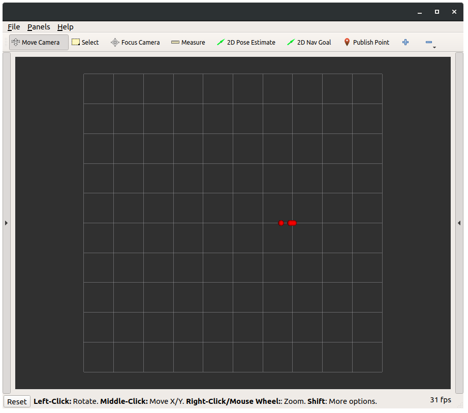

==================================================
Distributed Model Predictive Control (MPC)
==================================================

In this page we show how to implement a distributed Model Predictive Control
(MPC) algorithm for linear systems. We consider the classical algorithm proposed
in the paper :cite:`mpc-richards2007robust` applied to single-integrator systems as in the numerical
example of :cite:`mpc-richards2007robust`. The resulting algorithm is simulated by using the integration
features of **ChoiRbot** and visualization with RVIZ.

Prerequisites
----------------------------
We assume a working installation of **ChoiRbot** is available
(see the :ref:`installation page <installation>`) and that the
desktop version of ROS 2 is installed (this example requires RVIZ).
This example requires the `DISROPT <https://github.com/OPT4SMART/disropt>`_
package to be installed.

The reader is assumed to be familiar with the basic concepts
of ROS 2, Python and **ChoiRbot**
(see the :ref:`quick start page <quickstart>`).

Maths of the problem
----------------------------
We consider :math:`N` robots with linear dynamics that must be regulated to the
origin while satisfying a given set of coupling constraints among their outputs.

System dynamics and communication graph
~~~~~~~~~~~~~~~~~~~~~~~~~~~~~~~~~~~~~~~~
The considered algorithm models each robot as having discrete-time linear dynamics

.. math::

    \begin{aligned}
        x_i(t+1) &= A_i x_i(t) + B_i u_i(t),
        \\
        y_i(t) &= C_i x_i(t) + D_i u_i(t),
    \end{aligned}

where for all :math:`i \in \{1, \ldots, N\}`, :math:`x_i \in \mathbb{R}^{n_i}` is the
:math:`i`-th system state, :math:`u_i \in \mathbb{R}^{m_i}`
is the system input, :math:`y_i \in \mathbb{R}^{p}` is the
system output and the matrices :math:`A_i, B_i, C_i, D_i` have appropriate
dimensions. Note that all the robots have the same output dimension :math:`p`.

In the considered distributed MPC scheme the robots are assumed to be ordered
sequentially according to their labels :math:`i \in \{1, \ldots, N\}` and that
they communicate according to this structure.

Cost function and constraints
~~~~~~~~~~~~~~~~~~~~~~~~~~~~~~~~~~~~~~~~~~~
Each robot wants to minimize a quadratic stage cost of the type

.. math::

    \ell_i(x_i, u_i) = x_i^\top Q_i x_i + u_i^\top R_i u_i,

for some positive definite matrices :math:`Q_i, R_i`. Note that this
objective function encodes the regulation task.
The robots are assumed to have individual constraints on the
states and/or on the inputs that can be modeled as inequalities,

.. math::

    \begin{aligned}
        x_i &\in \mathcal{X_i} = \{x_i \mid E_i x_i \le f_i\},
        \\
        u_i &\in \mathcal{U_i} = \{u_i \mid G_i u_i \le h_i\},
    \end{aligned}

for some matrices :math:`E_i, G_i` and some vectors :math:`f_i, h_i`.
The coupling among the robot outputs :math:`y_i` is realized with
the inequality constraint

.. math::

    \sum_{i=1}^N y_i \le b,

with :math:`b \in \mathbb{R}^p`.

Distributed control scheme
~~~~~~~~~~~~~~~~~~~~~~~~~~~~~~
The conceptual idea of MPC is to solve an optimal control problem over a finite
prediction horizon :math:`T \in \mathbb{N}`, and then to apply only the first
piece of the computed input trajectory. Subsequently, a new optimization problem
is formulated taking the realized system state as new initial condition.
The distributed MPC algorithm considered here approximates the overall optimal control
problem (involving all the robots) with a sequence of local sub-problems. Each
robot :math:`i` solves once per iteration a sub-problem, involving only its own control
inputs as decision variables and fixing the information regarding the other robots to
the estimates received by robot :math:`i-1`.

The optimal control problem solved by robot :math:`i` at each time :math:`t` is as follows

.. math::

    \begin{aligned}
        \min_{x_i, u_i} \:
        & \: \sum_{\tau=0}^{T-1} \ell_i\big( x_i(t+\tau|t), u_i(t+\tau|t) \big)
        \\
        \text{subj. to} \:
        & \: x_i(t+\tau+1|t) = A_i x_i(t+\tau|t) + B_i u_i(t+\tau|t) & \text{(dynamics)}
        \\
        & \: y_i(t+\tau|t) = C_i x_i(t+\tau|t) + D_i u_i(t+\tau|t) & \text{(output)}
        \\
        & \: y_i(t+\tau|t) + \sum_{j \ne i} \bar{y}_j(t+\tau|t) \le b & \text{(robot coupling)}
        \\
        & \: x_i(t|t) = x(t)  & \text{(initial condition)}
        \\
        & \: x_i(t+\tau|t) \in \mathcal{X}_i, \:\: u_i(t+\tau|t) \in \mathcal{U}_i & \text{(local constraints)}
        \\
        & \: \text{for } \tau = 0, \ldots, T-1.
    \end{aligned}

In the previous problem, the notation :math:`x_i(t+\tau|t)` denotes the state
trajectory at time :math:`t+\tau` that has been predicted at time :math:`t`
(and similarly for :math:`u_i` and :math:`y_i`), while :math:`x_i(t)` is the
actual (measured) state.
The symbols :math:`\bar{y}_j(t+\tau|t)` denote the estimates of the output
trajectories of the other robots.

The overall distributed MPC algorithm is as follows.

i) Set :math:`t = 0` and find a set of output trajectories :math:`\bar{y}_i(\tau|0), i = 1, \ldots, N` satisfying the
   coupling constraints for all :math:`\tau \in \{0, \ldots, T-1\}`.
ii) For :math:`i = 1, \ldots, N` let robot :math:`i` do the following

  a) receive the set of output trajectories
  b) solve the local optimal control problem
  c) update the set of output trajectories by replacing :math:`\bar{y}_i` with
     the newly computed :math:`y_i`

iii) Set :math:`t \leftarrow t+1` and go to step 2

It is important to note that, when going from step 3 to step 2, the robots must
extend the output trajectories :math:`\bar{y}_i` (i.e. they must determine
:math:`\bar{y}_i(t+T)`) while ensuring that the new trajectories satisfy
the coupling constraints :math:`\sum_{i=1}^N y_i \le b` at time :math:`t+T`.
To implement this scheme, it is assumed that the robots already know how to
perform such an operation.

Implementation in ChoiRbot
--------------------------------
In order to implement the MPC example in **ChoiRbot**,
we consider the following nodes for each robot:

* a Team Guidance node implementing the computation/communication steps of the
  distributed MPC algorithm and computes :math:`u_i(t)` with a certain frequency
* an Integrator node that computes the evolution of the robot's state according
  to the applied inputs with a higher frequency than the Team Guidance node
* a visualization node that publishes the current position to the RVIZ topic

As required by the **ChoiRbot** paradigm, we finally write the launch file and
the executable scripts for the three nodes.

We analyze each of these components separately in the following subsections.

Team Guidance (main class)
~~~~~~~~~~~~~~~~~~~~~~~~~~~~~~
To implement the steps of the distributed MPC algorithm, we need to use the optimization
features, therefore the resulting class for the Team Guidance layer must extend the
class :class:`~choirbot.guidance.OptimizationGuidance`, which requires the method
``_optimization_ended`` (called at the end of an optimization) to be implemented.
For the new class, we will require

* an initialization block that stores information on the control scenario (system matrices,
  cost function, constraints, prediction horizon, output trajectory continuation)
* a method called with a user-defined frequency and asking the optimization thread
  to solve the optimal control problem
* the method ``_optimization_ended`` (called upon optimization completion),
  which sends the trajectory to the next robot and shifts the prediction horizon

The implementation of these main components in the new class
:class:`~choirbot.guidance.mpc.MPCGuidance` is as follows:

.. code-block:: python

    import numpy as np
    from choirbot.optimizer import MPCOptimizer
    from choirbot.guidance import OptimizationGuidance

    class MPCGuidance(OptimizationGuidance):

        # initialization of the class
        def __init__(self, sampling_period, pos_handler, pos_topic):
            super().__init__(MPCOptimizer(), MPCOptimizationThread, pos_handler, pos_topic)
            self.sampling_period = sampling_period
            self.timer = self.create_timer(sampling_period, self.control)
            self.ctrl_publisher = self.create_publisher(Vector3, 'velocity', 1)
            self.system_matrices = None
            self.traj_continuation = None
            self.output_trajectories = {}
            self.prediction_horizon = None
            self.can_control = False
        
        # initialization of the control scenario
        def initialize(self, prediction_horizon, system_matrices, cost_matrices,
                traj_continuation, coupling_constraints, local_constraints):
            # initialize local variables
            self.system_matrices = system_matrices
            self.traj_continuation = traj_continuation
            self.prediction_horizon = prediction_horizon

            # initialize optimization scenario
            self.optimizer.initialize_scenario(self.agent_id, prediction_horizon,
                system_matrices, cost_matrices, coupling_constraints, local_constraints)

            # mark class as ready
            self.can_control = True
        
        # main control loop (before optimal control problem)
        def control(self):
            # initialize output trajectory (only the first time)
            if not self.output_trajectories:
                self.initialize_output_trajectory()

            # gather new trajectories at agent 0
            self.collect_trajectories()

            # receive trajectories from agent i-1
            if self.agent_id != 0:
                traj = self.communicator.neighbors_receive([self.agent_id-1])
                self.output_trajectories = traj[self.agent_id-1]
            
            # create and solve local optimal control problem
            self.optimizer.create_opt_control_problem(self.current_pose.position[0], self.output_trajectories)
            self.optimization_thread.optimize()
        
        # main control loop (after optimal control problem)
        def _optimization_ended(self):
            # get resulting trajectories (from 0 to T-1)
            state_traj, input_traj, output_traj = self.optimizer.get_result()

            # update set of output trajectories
            self.output_trajectories[self.agent_id] = output_traj

            # send trajectories to agent i+1
            if self.agent_id != self.n_agents-1:
                self.communicator.neighbors_send(self.output_trajectories, [self.agent_id+1])

            # apply control input and shift horizon
            self.send_input(input_traj[:, 0])
            self.shift_horizon(state_traj)
        
        def shift_horizon(self, state_traj):
            # ... extend local output trajectory by calling self.trajectory_continuation()
        
        def collect_trajectories(self):
            # ... collection of trajectories at agent 0

Although the final class has additional components and checks not reported here,
the main flow is well represented by the previous code block.
Let us highlight some details. Consider the beginning of the
initialization block:

.. code-block:: python

    def __init__(self, sampling_period, pos_handler, pos_topic):
        super().__init__(MPCOptimizer(), MPCOptimizationThread, pos_handler, pos_topic)

This instruction calls the method :func:`choirbot.guidance.OptimizationGuidance.__init__`,
which requires an :class:`~choirbot.optimizer.Optimizer` and an
:class:`~choirbot.guidance.optimization_thread.OptimizationThread`
(actually, only its type). The :class:`~choirbot.optimizer.MPCOptimizer` class is
responsible for solving optimal control problems, while the
:class:`~choirbot.guidance.mpc.mpc.MPCOptimizationThread` class is responsible for
starting and stopping the optimization process (more details next).
The optimizer is firstly called in the ``initialize`` method:

.. code-block:: python

    self.optimizer.initialize_scenario(self.agent_id, prediction_horizon,
        system_matrices, cost_matrices, coupling_constraints, local_constraints)

Here, the optimizer is provided with the necessary information to
formulate optimal control problems. The thread is called in
the ``control`` method:

.. code-block:: python

    self.optimizer.create_opt_control_problem(self.current_pose.position[0], self.output_trajectories)
    self.optimization_thread.optimize()

Here, we provide the optimizer with the current robot state :math:`x(t)`
and with the estimates of the output trajectories :math:`\bar{y}_j(t+\tau|t)`
for :math:`j \ne i` and :math:`\tau = 0, \ldots, T-1`. Then, we ask the
optimization thread to start the optimization process. When the optimization
has finished, the optimization thread triggers execution of the
``_optimization_ended`` callback, which finalizes the current control
iteration and prepares the robot for the next one (this mechanism is already
implemented by the classes
:class:`~choirbot.guidance.optimization_thread.OptimizationThread`
and :class:`~choirbot.guidance.OptimizationGuidance`).

Team Guidance (optimization classes)
~~~~~~~~~~~~~~~~~~~~~~~~~~~~~~~~~~~~~
Let us give more details on the optimization-related classes.
The class :class:`~choirbot.guidance.mpc.mpc.MPCOptimizationThread` is very
straightforward since it extends the abstract class
:class:`~choirbot.guidance.optimization_thread.OptimizationThread` as follows:

.. code-block:: python

    from choirbot.guidance.optimization_thread import OptimizationThread

    class MPCOptimizationThread(OptimizationThread):

        def do_optimize(self):
            self.optimizer.optimize()

Indeed, the class :class:`~choirbot.guidance.optimization_thread.OptimizationThread`
already provides all the features to start and stop the optimization,
and we are only required to specify that the body of the optimization
process is entirely delegated to :class:`~choirbot.optimizer.MPCOptimizer`.

The :class:`~choirbot.optimizer.MPCOptimizer` class provides the necessary
features to solve optimal control problems by using
`DISROPT <https://github.com/OPT4SMART/disropt>`_
under the hood. We only report its main structure:

.. code-block:: python

    from choirbot.optimizer import Optimizer

    class MPCOptimizer(Optimizer):
        
        def initialize_scenario(self, robot_id, prediction_horizon, system_matrices,
                cost_matrices, coupling_constraints, local_constraints):
            # initialize a parametric optimal control problem
            # (parameters are initial conditions and output trajectories)
        
        def create_opt_control_problem(self, initial_condition, output_trajectories):
            # create actual optimal control problem

        def optimize(self):
            # solve optimal control problem and keep track of solution

        def get_result(self):
            # ... do calculations
            return x_traj, u_traj, y_traj

Integration of dynamics
~~~~~~~~~~~~~~~~~~~~~~~~~~~~~~
The Team Guidance layer will publish control inputs in the ``velocity`` topic.
To address integration of the robot dynamics and publication of odometry
messages, we simply use the :class:`choirbot.integrator.SingleIntegrator`
class, which subscribes to the ``velocity`` topic, integrates the dynamics
with a user-defined frequency and publishes the updated position in the
``odom`` topic.

Visualization
~~~~~~~~~~~~~~~~~~~~~~~~~~~~~~
For the visualization node we use the class :class:`choirbot.utils.Visualizer`.
The purpose of this node is very simple: to subscribe to the ``odom`` topic
and to forward messages to the ``/visualization_marker`` topic. RVIZ reads
data from this topic and draws circles (representing robots) at the
specified positions.

Launch file and executables
~~~~~~~~~~~~~~~~~~~~~~~~~~~~~~
See :ref:`the corresponding section <launch_file>` in the formation control example.

Running the simulation
-----------------------------
To run the simulation, we simply need to execute the launch file.
First we source the workspace:

.. code-block:: bash

    source install/setup.bash

Now we are ready to run the example:

.. code-block:: bash

    ros2 launch choirbot_examples mpc.launch.py

An RVIZ window will open. After a few seconds, the circles (representing robots)
begin to move toward the origin while keeping their inter-distance within the prescribed
bounds:

.. rubric:: References

.. bibliography:: ../biblio.bib
    :labelprefix: MPC
    :keyprefix: mpc-