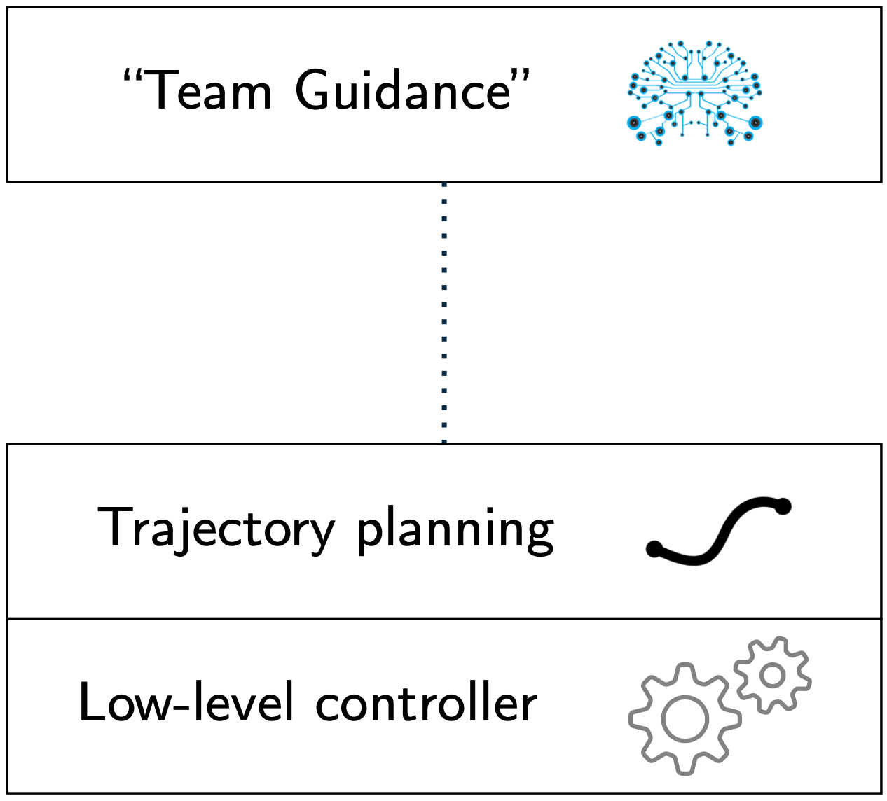

# Welcome to the ChoiRbot Page!

## What is ChoiRbot?
**ChoiRbot** is a ROS 2 package developed by [Andrea Testa](https://andrea-testa.github.io), [Andrea Camisa](https://www.unibo.it/sitoweb/a.camisa/en) and [Giuseppe Notarsefano](https://www.unibo.it/sitoweb/giuseppe.notarstefano/en) within the ERC excellence research project [OPT4SMART](http://opt4smart.dei.unibo.it/). The aim of **ChoiRbot** is to provide a comprehensive framework to easily simulate and run experiments on teams of cooperating robots, with a particular focus on peer-to-peer networks of robotic agents without a central coordinator.

If you are you using **ChoiRbot** in research work to be published, please cite the accompanying paper "_A. Testa, A. Camisa, G. Notarstefano_, ChoiRbot: A ROS 2 toolbox for cooperative robotics, IEEE Robotics and Automation Letters, 6(2), 2714-2720, 2021". Find more [here](citeus).

If you like <b>ChoiRbot</b> support us on GitHub!
<a class="github-button" href="https://github.com/OPT4SMART/ChoiRbot" data-icon="octicon-star" data-size="large" data-show-count="true" aria-label="Star OPT4SMART/ChoiRbot on GitHub">Star</a>

## What can you do with ChoiRbot?

With **ChoiRbot** you can develop a full-stack multi-robot application. Specifically, the package allows you to

- Encode distributed optimization and control algorithms
- Perform peer-to-peer communications among robots
- Develop planning and control schemes
- Connect with external motion capture hardware (see also our [ROS 2 Vicon Bridge](https://github.com/OPT4SMART/ros2-vicon-receiver))
- Run experiments on your robotic fleet
- Perform realistic simulations with [Gazebo](http://gazebosim.org) and visualize data with [RVIZ](https://github.com/ros2/rviz)

**ChoiRbot** is structured in a three-layer architecture. Specifically, there is a *Team Guidance* layer, a *RoboPlanning* layer and a *RoboControl* layer. The *Team Guidance* layer is responsible for taking high-level decisions and for managing the robot lifecycle. The *Team Guidance* layer uses communication with neighbors in order to perform its tasks. The *RoboPlanning* and *RoboControl* layers are responsible for lower-level control actions as driven by the upper layer. In case the user does not want to use external tools, we also provide a dynamics integration layer, named *RoboIntegration*, which can e.g. be used in conjunction with Rviz for visualization.

         &nbsp;&nbsp;&nbsp;&nbsp;

To guarantee flexibility and code reusability, layers are implemented as Python classes. For each layer, **ChoiRbot** provides boilerplate code that you can easily extend according to your need.

<!-- Place this tag in your head or just before your close body tag. -->

