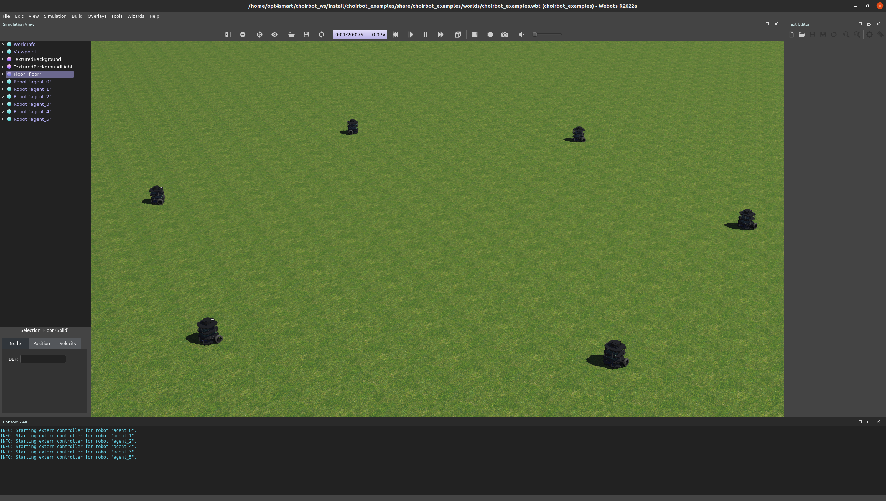

# Installation


In this page, we provide the installation procedure for the **ChoiRbot** package.
In the first part of the page we detail the procedure to install **ChoiRbot** from scratch.
We strongly recommend to run **ChoiRbot** in a Docker container, please see the section [*Docker Installation*](#docker-installation).

## Toolbox download and build

The **ChoiRbot** toolbox currently supports ROS 2 Jazzy Jalisco.
Please refer to the [ROS 2 website](https://docs.ros.org/en/jazzy/index.html) for a comprehensive
tutorial on how to install ROS 2. We suggest to perform the *Desktop Install* of ROS 2,
which provides useful tools such as RVIZ.

Create a ROS 2 workspace folder:

	mkdir -p ~/choirbot_ws/src
	cd ~/choirbot_ws/src

To download **ChoiRbot**, clone the package repository:

	git clone --recursive https://github.com/OPT4SMART/ChoiRbot.git .

### Installation of required Python packages

Create a Python virtual environment, if you don't refer to the [official guide](https://docs.python.org/3/library/venv.html#creating-virtual-environments). 

**ChoiRbot** requires a set of Python packages, including also the [DISROPT package](https://github.com/OPT4SMART/disropt), that can be installed by running
(inside the ``src/docker`` directory of your workspace):

	pip3 install --upgrade pip
    pip3 install -r requirements.txt
    pip3 install --no-deps disropt

### Installation of Gazebo and Turtlebot3 files

**ChoiRbot** allows yo to easily simulate a team of Turtlebot3 mobile robots.
You just need to install Gazebo Harmonic via

	sudo apt-get install ros-${ROS_DISTRO}-ros-gz

Then, you have to clone the ROS 2 workspace provided [here (Gazebo Simulation tab)](https://emanual.robotis.com/docs/en/platform/turtlebot3/simulation/) and add to the ``.bashrc`` file the following lines (notice that the paths may need to be adjusted according to your current installation).

	export TURTLEBOT3_MODEL=burger
	source ~/turtlebot3_ws/install/setup.bash
	export ROS_DOMAIN_ID=30 #TURTLEBOT3
	
### Installation of Webots

To install Webots R2025a follow the official guide [here](https://cyberbotics.com/doc/guide/installation-procedure#installing-the-debian-package-directly).

### Building package
	
Finally, build your workspace:

	cd ~/choirbot_ws
	rosdep install --from-paths src -y --ignore-src
	colcon build --symlink-install

## Docker Installation

Follow this instructions to dockerize the ChoiRbot repository by building a Docker image and creating a Docker container.

### Prerequisites

This Docker utils has been tested on the following configuration:
- ✅ Nvidia Driver 575.57.08
- ✅ CUDA 12.9
- ✅ Docker 28.2.2
- ✅ Docker Compose 2.36.2
- ✅ NVIDIA Container Toolkit CLI 1.17.8
- ✅ Ubuntu 24.04 LTS Noble Numbat

### Nvidia drivers

| ⚠️ Do you have a dedicated NVIDIA GPU? |
|:------------------------------------|
| If not, just install docker following the official [guidelines](https://docs.docker.com/engine/install/ubuntu/) and jump directly to the [Building the Docker Image](#building-the-docker-image) section. |
| If you have a dedicated NVIDIA GPU, follow the instructions below to install the NVIDIA drivers and the NVIDIA Container Toolkit. |

Check your NVIDIA driver version:

```bash
nvidia-smi
```

The output should be something like this:

```bash
+---------------------------------------------------------------------------------------+
| NVIDIA-SMI 575.57.08             Driver Version: 575.57.08   CUDA Version: 12.9     |
|-----------------------------------------+----------------------+----------------------+
| GPU  Name                 Persistence-M | Bus-Id        Disp.A | Volatile Uncorr. ECC |
| Fan  Temp   Perf          Pwr:Usage/Cap |         Memory-Usage | GPU-Util  Compute M. |
|                                         |                      |               MIG M. |
|=========================================+======================+======================|
|   0  NVIDIA GeForce GTX 1050        Off | 00000000:01:00.0 Off |                  N/A |
| N/A   63C    P3              N/A /  14W |    534MiB /  4096MiB |      0%      Default |
|                                         |                      |                  N/A |
+-----------------------------------------+----------------------+----------------------+
                                                                                         
+---------------------------------------------------------------------------------------+
| Processes:                                                                            |
|  GPU   GI   CI        PID   Type   Process name                            GPU Memory |
|        ID   ID                                                             Usage      |
|=======================================================================================|
|  No running processes found                                                           |
+---------------------------------------------------------------------------------------+
```

If not, install the driver and CUDA followinf the official guide [here](https://docs.nvidia.com/cuda/cuda-installation-guide-linux/), then restart the pc.

Now, run
```bash
glxinfo | grep "OpenGL"
```
to check if a hardware accelerated driver is installed. The output should be:

```bash
OpenGL vendor string: NVIDIA Corporation
OpenGL renderer string: NVIDIA GeForce GTX 1050/PCIe/SSE2
OpenGL core profile version string: 4.6.0 NVIDIA 575.57.08
OpenGL core profile shading language version string: 4.60 NVIDIA
OpenGL core profile context flags: (none)
OpenGL core profile profile mask: core profile
OpenGL core profile extensions:
OpenGL version string: 4.6.0 NVIDIA 575.57.08
OpenGL shading language version string: 4.60 NVIDIA
OpenGL context flags: (none)
OpenGL profile mask: (none)
OpenGL extensions:
OpenGL ES profile version string: OpenGL ES 3.2 NVIDIA 575.57.08
OpenGL ES profile shading language version string: OpenGL ES GLSL ES 3.20
OpenGL ES profile extensions:
```
If in the first two lines your NVIDIA card does not appear, then try to select it as the prime GPU with 
```bash
sudo prime-select nvidia
```
then, restart your pc.

### Docker and NVIDIA Container Toolkit

Check your docker version.
```bash
docker --version
```
>NOTE: if docker is not installed, follow the official [guidelines](https://docs.docker.com/engine/install/ubuntu/). 

Check also the NVIDIA Container Toolkit.
```bash
nvidia-ctk --version
```

>NOTE: if nothing appears, follow the official [guidelines](https://docs.nvidia.com/datacenter/cloud-native/container-toolkit/latest/install-guide.html) to install the **NVIDIA Container Toolkit**

If everything is ok, you can start playing with Docker!


### Building the Docker Image

Before building the Docker image, make sure you have cloned the ChoiRbot repository in a directory named `choirbot_ws/src/`.

>NOTE: If not, clone the repository as follows:
```bash
mkdir -p ~/choirbot_ws/src
cd ~/choirbot_ws/src
git clone --recursive https://github.com/OPT4SMART/ChoiRbot.git .
```

Before building the Docker image, make sure to edit the variables in the `.env` file, which will be used by the Docker Compose setup.

### About the `.env` file

The `.env` file contains environment variables that configure the Docker build and container setup. Here’s a description of each variable:

- **IMAGE_PATH**: The absolute path to the directory containing your Docker context (typically the path to the `choirbot_ws/src` folder).
- **IMAGE_NAME**: The name and tag for the Docker image you want to build (e.g., `choirbot:jazzy`).
- **CONTAINER_NAME**: The name to assign to your Docker container (e.g., `choirbot_dev`).
- **WS_NAME**: The name of your ROS 2 workspace inside the Docker container (e.g., `choirbot_ws`).

Example `.env` file:
```properties
IMAGE_PATH=/path/to/choirbot_ws/src
IMAGE_NAME=choirbot:jazzy
CONTAINER_NAME=choirbot_dev
WS_NAME=choirbot_ws
```

Adjust these variables as needed for your setup before proceeding.

### Build Docker image

To build our Docker image for ChoiRbot, execute the following command in the terminal from the `root` directory of the repository:

```bash
docker compose -f choirbot_ws/src/docker/compose.yaml build dev
```

This command runs the `Dockerfile` and uses the `.env` file, both located in the `choirbot_ws/src/docker`.

The building process can take a while (10-20mins), so be patient!

### Creating a Docker Container

After the image is built, create a Docker container with the following command:

```bash
xhost + && docker compose -f choirbot_ws/src/docker/compose.yaml up -d dev
```

where `dev` is the name of the service inside the docker compose file. This will create and start a Docker container in detached mod.

Once the container is created, you can start exploiting the toolbox.


### Running the Docker Container

If you have already created the container, you can start it by running the following command:

```bash
docker compose -f choirbot_ws/src/docker/compose.yaml start dev
```

Then, you can open a shell in the container by running the following command:

```bash
docker compose -f choirbot_ws/src/docker/compose.yaml exec dev bash
```

This command opens an interactive shell in the container, allowing you to run commands and receive output from the container.

### Running the ChoiRbot Examples

Once you have opened a shell in the container, you can run the ChoiRbot examples by following these steps:

```bash
colcon build --symlink-install
source install/setup.bash
ros2 launch choirbot_examples formationcontrol_ca_webots.launch.py
```
Your monitor should display something like that

<p style="text-align:center">
  
</p>

_Have fun!_ 🚀
